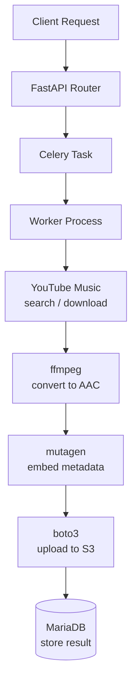

# Architecture

## Data Flow



## Concurrency Model

The API uses a **concurrent worker pool** via the `billiard` library to manage multiple download/convert/upload operations in parallel within each Celery worker process. This allows efficient use of I/O-bound operations.

- **Celery workers** consume tasks from Redis/Valkey
- **Billiard pool** manages subprocesses for parallel downloads
- **FFmpeg** runs as a subprocess for audio conversion

## Database Schema

Key tables:

- **jobs** — tracks import job lifecycle (pending, running, completed, failed)
- **tracks** — stores individual track metadata and S3 paths
- **albums** — album-level metadata and cover art references

## S3 Path Convention

Uploaded files follow this path pattern:

```
{artist}/{album}/{track_number} - {track_title}.m4a
```
