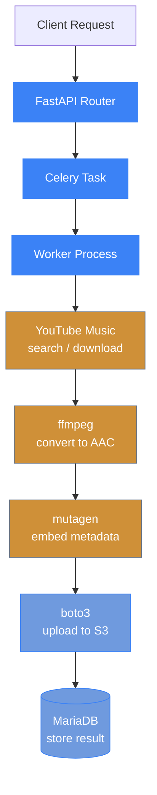

# Architecture

## Data Flow



## Concurrency Model

Each Celery worker process uses a `ThreadPoolExecutor` to download, convert, and upload songs within an album or playlist in parallel. This allows efficient utilization of I/O-bound operations.

- **Celery workers** consume tasks from Valkey/Redis using the `prefork` pool
- **ThreadPoolExecutor** (from `concurrent.futures`) manages per-song parallelism within each worker
- **FFmpeg** runs as a subprocess for audio conversion
- **Optional auth middleware** enforces `X-API-Key` header on all routes except `/health`

## Database Schema

Key tables:

- **jobs** — tracks import job lifecycle (pending, running, success, failed)
- **songs** — stores individual song metadata and S3 paths

`jobs` table columns: `id`, `job_type` (album/playlist), `browse_id`, `status`, `message`, `error`, `current_album`, `album_name`, `artist`, `album_progress`, `total_albums`, `current_song`, `total_songs`, `created_at`, `updated_at`

`songs` table columns: `id`, `job_id` (FK), `title`, `artist`, `album`, `track_number`, `status` (pending/downloading/success/failed), `s3_path`, `error`, `release_date`, `created_at`

## S3 Path Convention

Uploaded files follow this path pattern:

```
{artist}/{album}/{track_number} - {track_title}.m4a
```
