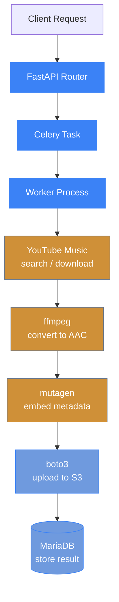

# Architecture

## Data Flow



## Concurrency Model

Each Celery worker process uses a `ThreadPoolExecutor` to download, convert, and upload songs within an album or playlist in parallel. This allows efficient utilization of I/O-bound operations.

- **Celery workers** consume tasks from Valkey/Redis using the `prefork` pool
- **ThreadPoolExecutor** (from `concurrent.futures`) manages per-song parallelism within each worker
- **FFmpeg** runs as a subprocess for audio conversion
- **Auth middleware** enforces API key (X-API-Key), OIDC Bearer token, or GitHub Bearer token on all routes except `/health`, `/thumbnail`, and OPTIONS preflight
- **Scheduler** (`api/scheduler.py`) runs inside the API pod and dispatches the library index scan(s) on a timer (no separate Celery beat container)

## Database Schema

Key tables:

- **jobs** — tracks import job lifecycle (pending, running, success, failed)
- **songs** — stores individual song metadata and S3 paths
- **available_albums** — mirrors the current backend library contents (upserted + pruned by the periodic index scan); used to flag search results already in the library

`jobs` table columns: `id`, `job_type` (album/playlist), `browse_id`, `status`, `message`, `error`, `current_album`, `album_name`, `artist`, `requested_by`, `album_progress`, `total_albums`, `current_song`, `total_songs`, `created_at`, `updated_at`

`songs` table columns: `id`, `job_id` (FK), `title`, `artist`, `album`, `track_number`, `status` (pending/downloading/success/failed), `s3_path`, `error`, `release_date`, `created_at`

`available_albums` columns: `artist`, `album`, `browse_id`, `track_count`, `last_seen`, `created_at`

## Valkey Database Usage

| Database | Purpose |
|----------|---------|
| db 0 | Celery broker |
| db 1 | Celery result backend |
| db 2 | Search result cache (5 min TTL) + available-albums index reads |
| db 3 | Thumbnail image cache (24 h TTL) + cookie store (content + staleness flag) |
| db 4 | Library index dispatch lock |

## Library Index

Search results are flagged with an `available` boolean when the album/playlist already exists in the backend library.

1. **Recording** — download tasks (`tasks/download.py`) upsert every successfully downloaded album/playlist into `available_albums` with its exact YT Music `browse_id`.
2. **Periodic scan** — a dispatcher in the API pod (`api/scheduler.py`) runs every `INDEX_INTERVAL_MINUTES` (default 30) and triggers one or both index tasks depending on `INDEX_SOURCE`:
   - `tasks.index_albums` scans the S3 bucket (`{artist}/{album}/` prefixes), upserts found items, and prunes entries no longer present in S3.
   - `tasks.index_navidrome` queries a Navidrome server's Subsonic API (`getAlbumList2`) for the albums it has indexed (a tag-accurate view of the same library).
   - Both feed the shared `available_albums` table via the same reconcile logic. A Valkey lock (db 4) ensures multiple API replicas dispatch only once per interval — no Celery beat container is required.
3. **Search enrichment** — `GET /search` matches each result against the index by `browse_id` (or normalized artist+title) after the cache read, so results stay fresh.

### Troubleshooting a Navidrome index scan returning 0 albums

An empty index is usually a connection/auth failure, not an empty library. Check the worker logs for the
specific error, or run the built-in diagnostic inside the worker pod:

```bash
kubectl exec -it <worker-pod> -- python -m zimmporter.navidrome
```

It prints the URL/user being used, the HTTP status, the Subsonic status, and whether albums were returned.
Common causes:

- `NAVIDROME_URL` unreachable from the worker (wrong host/DNS/port, e.g. an unresolvable placeholder hostname).
- Wrong `NAVIDROME_USER`/`NAVIDROME_PASS` (HTTP 401/403).
- Navidrome uses external auth (OIDC/Authelia via reverse proxy) with the Subsonic password disabled — set a
  Subsonic password in Navidrome for the API user.

## Cookies (YouTube auth)

Age-restricted downloads can be authenticated with an uploaded yt-dlp cookies file stored in **Valkey**:

1. **Upload** — `POST /cookies` accepts a Netscape-format `cookies.txt` (multipart), validates it, and stores it in Valkey (`zimmporter/cookie_store.py`, db 3). `GET /cookies` exposes metadata only — never contents. No shared file volume is required.
2. **Stale detection** — when yt-dlp reports "Sign in to confirm you're not a bot", invalid cookies, or cookie rotation during a download, the worker flags the cookies as stale (`zimmporter/cookie_health.py`, Valkey db 3). Downloads then run anonymously until a fresh upload clears the flag.
3. **Workers** — each job re-reads the cookies from Valkey and writes a local writable copy for yt-dlp, without a restart or shared mount.

## POT Provider (BgUtils)

When `POT_PROVIDER_URL` is set, yt-dlp requests PO (Proof of Origin) tokens from a [BgUtils yt-dlp POT provider](https://github.com/Brainicism/bgutil-ytdlp-pot-provider) server to bypass YouTube bot checks. A `bgutil-provider` service is included in docker-compose and the Helm chart.

## Thumbnail Proxy

When `API_PROXY_FETCH=true` is set, the API proxies thumbnail images from YouTube's CDN (which the frontend cannot reach directly):

1. **Search route** (`GET /search`) fetches all result thumbnails concurrently via `ThreadPoolExecutor(max_workers=10)` using the API's outbound connection
2. Each thumbnail URL is checked against Valkey db 3 — cache hits skip the upstream fetch
3. Missed thumbnails are downloaded (max 10 MB), cached for 24 hours, and returned as **base64 data URIs** (`data:{content_type};base64,...`)
4. The frontend renders these data URIs directly in `` tags with zero additional HTTP requests

A standalone `GET /thumbnail?url=` endpoint is also available for external integrations — it returns raw image bytes and is excluded from auth middleware.

## S3 Path Convention

Uploaded files follow this path pattern:

```
{artist}/{album}/{track_number} - {track_title}.m4a
```
