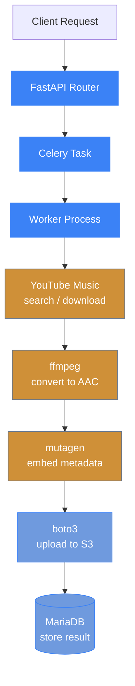

# Architecture

## Data Flow



## Concurrency Model

Each Celery worker process uses a `ThreadPoolExecutor` to download, convert, and upload songs within an album or playlist in parallel. This allows efficient utilization of I/O-bound operations.

- **Celery workers** consume tasks from Valkey/Redis using the `prefork` pool
- **ThreadPoolExecutor** (from `concurrent.futures`) manages per-song parallelism within each worker
- **FFmpeg** runs as a subprocess for audio conversion
- **Auth middleware** enforces API key (X-API-Key), OIDC Bearer token, or GitHub Bearer token on all routes except `/health`, `/thumbnail`, and OPTIONS preflight

## Database Schema

Key tables:

- **jobs** — tracks import job lifecycle (pending, running, success, failed)
- **songs** — stores individual song metadata and S3 paths

`jobs` table columns: `id`, `job_type` (album/playlist), `browse_id`, `status`, `message`, `error`, `current_album`, `album_name`, `artist`, `requested_by`, `album_progress`, `total_albums`, `current_song`, `total_songs`, `created_at`, `updated_at`

`songs` table columns: `id`, `job_id` (FK), `title`, `artist`, `album`, `track_number`, `status` (pending/downloading/success/failed), `s3_path`, `error`, `release_date`, `created_at`

## Valkey Database Usage

| Database | Purpose |
|----------|---------|
| db 0 | Celery broker |
| db 1 | Celery result backend |
| db 2 | Search result cache (5 min TTL) |
| db 3 | Thumbnail image cache (24 h TTL) |

## Thumbnail Proxy

When `API_PROXY_FETCH=true` is set, the API proxies thumbnail images from YouTube's CDN (which the frontend cannot reach directly):

1. **Search route** (`GET /search`) fetches all result thumbnails concurrently via `ThreadPoolExecutor(max_workers=10)` using the API's outbound connection
2. Each thumbnail URL is checked against Valkey db 3 — cache hits skip the upstream fetch
3. Missed thumbnails are downloaded (max 10 MB), cached for 24 hours, and returned as **base64 data URIs** (`data:{content_type};base64,...`)
4. The frontend renders these data URIs directly in `` tags with zero additional HTTP requests

A standalone `GET /thumbnail?url=` endpoint is also available for external integrations — it returns raw image bytes and is excluded from auth middleware.

## S3 Path Convention

Uploaded files follow this path pattern:

```
{artist}/{album}/{track_number} - {track_title}.m4a
```
