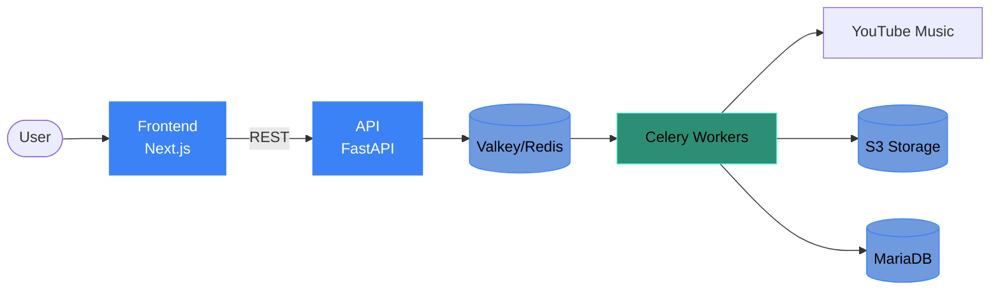

# Zimmporter Stack

A full-stack music import system. Search YouTube Music, download albums and playlists, convert audio to AAC, embed metadata and cover art, and upload the final files to an S3-compatible bucket. Already-downloaded albums are flagged in search results, YouTube cookies can be uploaded for age-restricted content, and a PO-token provider helps bypass bot checks.

## Components

| Component | Role | Stack |
|---|---|---|
| **API** | Backend service with async task queue | Python, FastAPI, Celery, Valkey/Redis, MariaDB |
| **Worker** | Celery worker processing downloads | Python, yt-dlp, ffmpeg, boto3, mutagen |
| **Frontend** | Web UI for searching and managing downloads | TypeScript, Next.js, React, PrimeReact |
| **Helm** | Kubernetes deployment chart | Helm 3 |

## Architecture Overview

The frontend communicates with the API via REST endpoints. The API dispatches long-running tasks (download, convert, upload) to Celery workers. Results and job status are stored in MariaDB.

## Repositories

- [zimmporter-api](https://github.com/Tomifarmer/zimmporter-api)
- [zimmporter-front](https://github.com/Tomifarmer/zimmporter-front)
- [zimmporter-helm](https://github.com/Tomifarmer/zimmporter-helm)
- [zimmporter-stack-doc](https://github.com/Tomifarmer/zimmporter-stack-doc)
